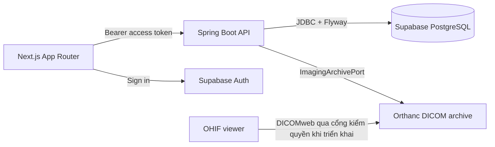

# Kiến trúc OTCMS

## Quyết định chính

Một repository, hai ứng dụng độc lập: Next.js và Spring Boot. Backend là **modular monolith** với Clean Architecture trong từng feature. Mỗi feature sở hữu luật nghiệp vụ, use case, port và adapter của mình. Package theo **feature**, không theo actor; Patient và Receptionist đều có thể gọi feature `appointment` với quyền khác nhau. Một Maven module giúp nhóm bắt đầu nhanh; chiều phụ thuộc hiện được giữ bằng quy ước/code review, chưa được compiler ép buộc.



## Backend

```text
backend/src/main/java/com/otcms/
├── OtcmsBackendApplication.java
├── shared/
│   ├── config/SecurityConfiguration.java
│   └── web/SystemController.java
├── account/
├── patient/
├── appointment/
├── reception/
├── visit/
├── clinical/
├── imaging/
│   ├── domain/                        Entity, value object, quy tắc thuần Java
│   ├── application/
│   │   ├── port/in/                   Interface của use case
│   │   ├── port/out/ImagingArchivePort.java
│   │   └── service/                   Handler thực thi use case
│   └── adapter/
│       ├── in/web/                    Controller, request, response
│       └── out/{persistence,orthanc}/ Adapter JPA và DICOMweb
├── billing/
└── reporting/
```

Các folder feature ngoài `imaging` trong cây trên là vị trí dành cho UC tương ứng; tạo code khi triển khai UC, không thêm class rỗng. Quy tắc phụ thuộc: `domain` không biết framework; `application` dùng domain và khai báo port; `adapter` triển khai port và dùng framework. Controller không gọi JPA repository. Feature khác không truy cập trực tiếp bảng/adapter của feature chủ sở hữu.

Luồng mẫu cho một UC: `POST /api/v1/appointments` → `AppointmentController` → `CreateAppointmentUseCase` → `CreateAppointmentHandler` → `AppointmentRepository` → `JpaAppointmentRepositoryAdapter`. Cả quyền actor lẫn quyền trên bản ghi được kiểm tra trong backend.

Supabase Auth xác thực danh tính. `role` trong JWT là PostgreSQL role, **không phải** vai trò phòng khám. Bảng account của ứng dụng và chính sách use case sẽ giữ vai trò Patient/Receptionist/Orthopedic Doctor/Imaging Technician/Administrator/Clinic Owner. Không ánh xạ vai trò nhóm từ claim `role`.

## Frontend

```text
frontend/src/
├── app/
│   ├── layout.tsx, page.tsx, globals.css
│   ├── login/page.tsx
│   └── workspace/page.tsx
├── features/
│   └── auth/components/SignInForm.tsx
├── components/                         UI dùng lại khi phát sinh
└── lib/
    ├── api/client.ts                    Gọi Spring API kèm access token
    └── supabase/browser.ts              Chỉ dùng Supabase Auth
```

Khi triển khai một feature, đặt `components/`, `hooks/`, `api/`, `schema/` và `types/` bên trong `src/features/<feature>/` theo nhu cầu thực tế. URL ở `app/` có thể chia theo khu vực patient/staff/admin; không tạo bản sao logic theo vai trò. `NEXT_PUBLIC_*` chỉ chứa thông tin công khai.

## DICOM/MRI

Orthanc lưu DICOM gốc; PostgreSQL lưu metadata, quan hệ bệnh nhân/lượt khám và trạng thái phát hành. OHIF chạy riêng để tránh xung đột dependency với Next.js. Compose hiện tạo một phòng thí nghiệm local cùng reverse proxy để OHIF gọi DICOMweb cùng origin. Đây chưa phải đường truy cập ảnh của bệnh nhân.

Khi triển khai UC hình ảnh: nhân viên upload → backend ghi nhận study UID và liên kết lượt khám → kỹ thuật viên/bác sĩ kiểm tra → phát hành → backend cấp quyền xem đúng study cho đúng người. Cần chặn truy cập DICOMweb trực tiếp ở môi trường triển khai và kiểm tra quyền cho QIDO/WADO/STOW, gồm cả thumbnail, metadata và frame. Không đưa ảnh DICOM vào Supabase Database hoặc Git.
